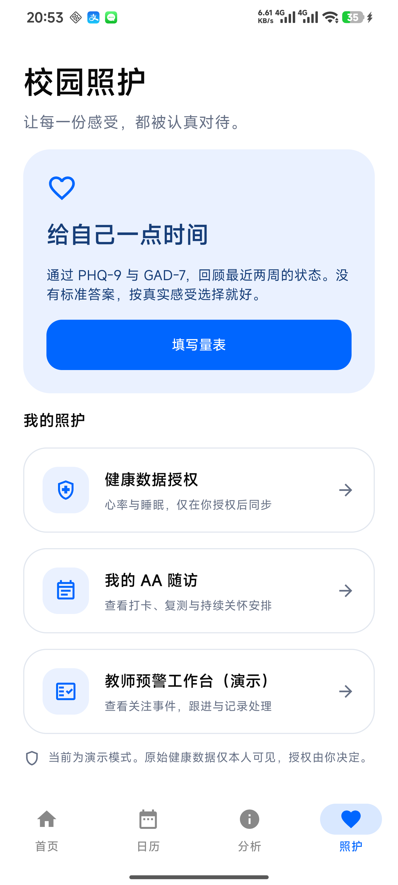
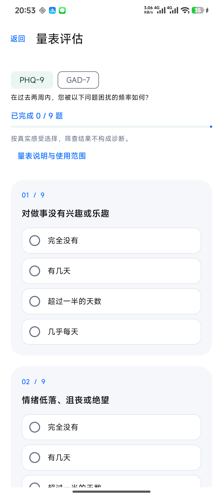
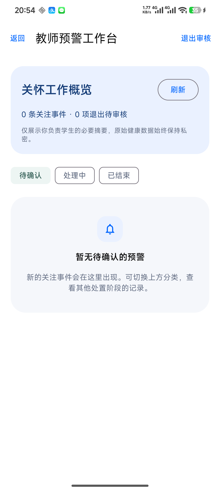
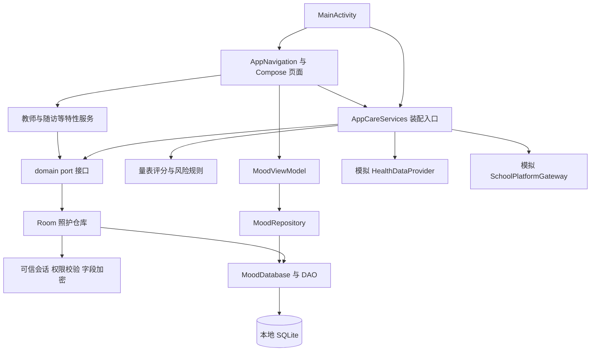

# 心情日历 · Mood Calendar

使用 **Kotlin、Jetpack Compose、Room** 构建的 Android 原生应用。系统提供两个相互隔离的角色入口：学生进入个人情绪管理空间，教师进入脱敏预警工作台；两端只通过最小化预警摘要和随访状态衔接。

**当前状态：已完成模块集成、首轮闭环和界面优化，并在 Android 16 真机上通过回归测试。** 校园照护使用演示身份、模拟健康数据和本地模拟学校平台，尚不是可直接部署到学校的生产系统。量表用于筛查，应用分析与预警不构成临床诊断。

[双角色入口重构](docs/testing/2026-09-22-双角色入口与权限隔离报告.md) · [深度洞察交互优化](docs/testing/2026-09-22-深度洞察交互优化报告.md) · [最新反馈修复与测试](docs/testing/2026-09-22-反馈问题修复与测试报告.md) · [功能测试报告](docs/testing/2026-09-18-功能测试报告.md) · [产品需求](Mood_Calendar_PRD.md)

## 界面预览

以下为 Android 16 真机截图；健康数据页与教师入口均为演示模式。

<table>
  <tr><th>校园照护</th><th>量表评估</th><th>教师工作台</th></tr>
  <tr>
    <td></td>
    <td></td>
    <td></td>
  </tr>
</table>

更多预览：[健康授权](docs/testing/evidence-ui-2026-09-18/health.png) · [AA 随访](docs/testing/evidence-ui-2026-09-18/followup.png)。

## 功能与实现状态

### 角色入口与主导航

| 身份 | 登录后首页 | 主导航 | 数据范围 |
|---|---|---|---|
| 学生 | 情绪日历首页 | 情绪日历、数据洞察、随访任务、我的 | 本人的日记、量表、原始健康数据、随访任务 |
| 教师 | 预警工作台 | 预警工作台、账号设置 | 被分配学生的脱敏预警摘要、处理记录与必要随访状态 |

当前仓库尚未接入学校统一认证，因此启动页提供两个明确标记的独立演示入口。该入口只选择固定的 DEMO 身份；正式接入时必须由认证结果返回角色，不能信任客户端提交的角色名称。

| 模块 | 当前能力 | 边界 |
|---|---|---|
| 心情日历 | 日历浏览、图文记录、首页与分析页记录横滑、日期回看、今日收获、日期复盘、深度洞察、情绪折线与周/月趋势、天气、可编辑纪念日与个性化设置 | 已通过编译、JVM 测试与 Lint；本轮按要求未执行真机测试 |
| 学生量表 | PHQ-9 / GAD-7 填写、进度与题号、评分、草稿状态恢复、提交防重、安全题提醒、历史结果回显 | 量表与日历日期的直接关联尚未实现 |
| 健康接入框架 | 心率/睡眠分别授权、撤回、演示数据同步、本人查看和按范围删除原始数据 | 未读取真实手环或手机健康库 |
| 风险评估 | 量表作为核心依据，生理信号作为辅助；关注分级、安全复核标签、预警去重 | 使用演示规则；生理异常不会独立把低分量表抬高为预警 |
| 教师工作台 | 责任范围内的预警摘要、确认、启动干预、加密处理记录、结束干预、退出审核 | 演示教师身份，不包含真实学校认证 |
| AA 随访 | 干预后自动入库并创建首轮任务；打卡、关联已保存量表的复测、教师联系、退出条件校验；提供不落库的只读演示视图 | 连续多周滚动调度和到期通知尚未完整接入主应用 |
| 学校平台接口 | 最小化事件 DTO、模拟回执、持久化待投递记录、应用前台重试 | 没有真实平台推送，也不保证应用被终止后的后台送达 |

学生端不显示预警工作台、教师工单或处置按钮。教师工作台不返回私人日记、量表逐题答案或原始健康数据；工单按钮根据待确认、处理中、已结束状态分别呈现。

目前可验证的首轮流程：

```text
学生填写量表 → 量表评估 + 已授权的生理辅助信号 → 分级预警
    → 教师确认与干预 → 自动进入 AA 随访并生成首轮任务
    → 打卡 / 复测 / 教师联系 → 满足条件后申请退出 → 教师审核
```

结束一次教师干预不会自动退出 AA；后续随访与退出审核分别处理。量表缺失或过期会标记数据不足；生理辅助读取失败时，仍可继续量表评估。

## 隐私与数据边界

- 原始健康数据仅通过学生本人接口读取；教师端取得代号、关注等级、必要标签与处置状态，不展示原始生理序列、逐题答案或日记。
- 仓库层校验学生归属、教师责任范围和数据域；演示数据与真实数据域分开。
- 使用 Android Keystore 与 AES-GCM 加密敏感字段，并绑定记录上下文；这不等同于整个数据库文件加密。
- 心率和睡眠授权默认关闭，可分别撤回。授权版本与最终入库检查用于拒绝撤回后的迟到回调。
- 撤回授权停止后续同步；删除历史原始数据是独立操作，也不会收回教师已经看到的最小化历史摘要。

当前身份切换用于原型演示，不能替代生产认证和服务端授权。请勿将真实学生数据、个人密钥或本机配置提交到仓库。

## 本地运行

### 环境

以仓库配置为准：

| 项目 | 配置 |
|---|---|
| Gradle Wrapper | 9.3.1 |
| Android Gradle Plugin | 9.1.1 |
| Gradle 守护进程 | JDK 21，见 `gradle/gradle-daemon-jvm.properties` |
| 代码编译工具链 | JDK 11，Java 兼容目标 11，见 `app/build.gradle.kts` |
| Android SDK | compileSdk 37 / targetSdk 37 / minSdk 24 |
| 应用包名 | `com.example.mdd_calender` |

1. 克隆仓库，用支持项目 AGP 配置的 Android Studio 打开根目录。
2. 在 SDK Manager 中准备 Android SDK Platform 37 和 Platform Tools；配置本机 SDK 路径，`local.properties` 不提交。
3. 准备 JDK 21 与编译工具链 JDK 11，完成 Gradle 同步。项目已配置工具链解析器，首次同步可能需要下载工具链及依赖。
4. 选择 `app`，运行到 Android 设备或模拟器。

```bash
git clone https://github.com/NaHSIT/mood_calendar.git
cd mood_calendar
```

Windows PowerShell 构建：

```powershell
.\gradlew.bat :app:assembleDebug
```

macOS / Linux 使用 `./gradlew :app:assembleDebug`。首次使用时如脚本没有执行权限，先执行 `chmod +x gradlew`。

生成的安装包位于 `app/build/outputs/apk/debug/app-debug.apk`。仓库保存源代码、测试和文档，构建缓存、签名密钥及生成的 APK 不作为源码提交。

### 手机安装与调试

开启手机开发者选项与 USB 调试，接受电脑调试授权。以下命令假设 `adb` 已加入 PATH：

```powershell
adb devices
adb install -r app/build/outputs/apk/debug/app-debug.apk
adb shell am start -n com.example.mdd_calender/.MainActivity
```

`-r` 用于覆盖安装并保留应用数据。部分手机还需开启“USB 安装”；自动化点击可能需要单独开启“USB 调试（安全设置）”。真机 UI 测试期间保持设备解锁，允许系统出现的测试应用启动提示。

## 测试与验证

**2026-09-18，代码基线 `cb6e6b9`：**

| 检查 | 结果 |
|---|---|
| Debug 应用与测试 APK 构建 | 通过 |
| JVM 单元测试 | 60 / 60 通过 |
| Android 真机测试 | 13 / 13 通过，其中 3 项为 Compose UI 测试 |
| Android Lint | 0 错误、60 警告 |
| 真机环境 | 23113RKC6C，Android 16 |

共 73 个测试方法，包含 2 个模板测试。业务/UI 用例覆盖量表提交、预警生成、教师连续操作、AA 首轮任务、授权撤回竞态、加密/权限隔离、迁移和模拟投递恢复。测试数据使用独立数据库；单台设备通过不代表全部 Android 版本、字体大小或无障碍场景已经验收。

**2026-09-19 增量验证：** 原有页面完成主题、宽度和滚动适配，教师退出审核入口并入工作台；60项 JVM 测试、10项非 UI 真机测试和 Lint 通过。3项 Compose UI 测试本次受测试宿主 Activity 启动超时影响，未重新取得通过结论。已验证浅色竖屏、1080×2400 覆盖尺寸，以及深色、1.3倍字体和横屏组合；详情见[界面适配与入口整合报告](docs/testing/2026-09-19-界面适配与入口整合报告.md)。

**2026-09-22 增量验证，功能代码基线 `698d6fe`：** 恢复情绪折线与周/月趋势，修复记录天数口径和量表结果回显，增加 AA 只读演示、纪念日编辑、首页记录横滑和日期复盘。Debug APK、测试 APK 和 Lint 通过；62 项 JVM 测试、10 项非 UI 真机测试通过；最新 APK 已在 Android 16 真机覆盖安装并正常冷启动。3 项 Compose UI 自动化仍受 MIUI 测试 Activity 启动超时影响，未取得通过结论；详情见[反馈问题修复与测试报告](docs/testing/2026-09-22-反馈问题修复与测试报告.md)。

**2026-09-22 深度洞察交互优化：** 分析页调整为“深度洞察—情绪趋势—量表评估”三级结构；认知反思支持点击进入事件、想法与证据三步练习，最近和历史记录均可横滑并进入日期详情，并增加连续记录、波动程度、高低点回看、常用记录时段和下一步建议。异常提醒直接连接 PHQ-9 / GAD-7 自评，旧关键词疾病推断器已移除。本轮 Debug 构建、64 项 JVM 测试和 Lint 通过，按要求未执行真机测试；详情见[深度洞察交互优化报告](docs/testing/2026-09-22-深度洞察交互优化报告.md)。

**2026-09-22 双角色入口重构：** 增加独立学生/教师演示入口和基于可信角色的落地页映射。学生端使用四个主导航，教师端使用两个主导航；学生首页增加本月情绪日历、量表状态和条件式随访提醒。教师详情按四段固定顺序展示，并区分评估提醒、安全预警与辅助标签。接口权限仍由 SessionProvider、本人归属、教师责任范围和数据域共同校验；Debug 构建、66 项 JVM 测试和 Lint 通过，本轮按要求不执行真机测试，详情见[双角色入口与权限隔离报告](docs/testing/2026-09-22-双角色入口与权限隔离报告.md)。

```powershell
# 本地单元测试、构建与静态检查
.\gradlew.bat :app:testDebugUnitTest :app:assembleDebug :app:assembleDebugAndroidTest :app:lintDebug

# 已连接并解锁的设备上执行真机测试
.\gradlew.bat :app:connectedDebugAndroidTest
```

日志与具体测试步骤：[分模块功能报告](docs/testing/2026-09-18-功能测试报告.md)、[界面改版回归报告](docs/testing/2026-09-18-UI优化验收.md)、[真机运行日志](docs/testing/evidence-ui-2026-09-18/instrumentation.log)。历史报告中的提交/安装状态以当次验收时间为准。

## 代码架构

项目目前只有一个 Gradle 模块 `:app`，采用 **Compose 界面 + 业务服务 + 领域接口 + Room 仓库** 的分层组织。`feature/*` 是同一模块内的功能包，不是独立安装包或 Gradle 子模块；学校平台与健康源目前由本地模拟实现提供，没有独立部署的照护后端。

原有心情功能主要通过 `MoodViewModel` 管理状态；新增照护功能使用页面状态、特性服务和 `AppCareServices` 编排，不是所有页面都统一经过 ViewModel。

### 目录与职责

```text
app/src/main/java/com/example/mdd_calender/
├── MainActivity.kt  # 初始化数据库、仓库、照护服务和根导航
├── ui/
│   ├── MoodViewModel.kt # 原有心情记录与偏好状态
│   ├── navigation/  # 根导航、路由与参数
│   ├── screens/     # 首页、日历、编辑、分析、纪念日和设置
│   ├── analysis/    # 情绪按日聚合、周月趋势与非诊断性反思规则
│   ├── components/  # 公共 UI 组件及照护卡片、空状态
│   └── theme/       # 主题、颜色与字体
├── feature/
│   ├── assessment/ # PHQ-9、GAD-7题本、草稿与评分
│   ├── health/     # 授权、同步、提供者适配、信号提取与界面
│   ├── risk/       # 演示风险规则与预警事件构造
│   ├── teacher/    # 教师工作台、状态与干预服务
│   └── followup/   # AA策略、任务、界面模型与仓库适配
├── integration/
│   ├── app/        # AppCareServices装配与流程编排、CareScreens路由界面
│   └── school/     # 模拟学校网关与协议说明
├── domain/
│   ├── model/      # 身份、量表、健康、预警、干预与随访公共模型
│   ├── port/       # 仓库、会话、健康源、风险引擎与平台网关接口
│   └── policy/     # 访问控制及AA退出策略
├── data/
│   ├── care/       # 照护Entity、DAO及Room仓库实现
│   └── ...         # MoodDatabase、原有记录仓库、偏好与天气服务
├── security/       # 演示会话、Android Keystore与AES-GCM字段加密
└── utils/          # 定位、原有分析等辅助逻辑
app/src/test/        # JVM 单元测试
app/src/androidTest/ # 真机业务、安全、迁移与 Compose UI 测试
docs/tasks/          # 模块任务书、契约和交接记录
docs/testing/        # 测试报告、日志与真机截图
docs/manuals/        # 六份软件说明书与操作手册
```

### 运行时依赖



该图描述运行时调用；领域接口由仓库或适配器实现。`MainActivity` 手动创建依赖，`AppCareServices` 为照护功能分别装配学生、教师和系统会话及对应仓库。系统会话用于内部评估，不等同于教师取得原始健康数据权限。

| 入口或实现 | 主要职责 | 修改时关注 |
|---|---|---|
| [MainActivity](app/src/main/java/com/example/mdd_calender/MainActivity.kt) | 初始化依赖，启动前台投递重试循环 | 生命周期与服务装配 |
| [AppNavigation](app/src/main/java/com/example/mdd_calender/ui/navigation/AppNavigation.kt) | 连接记录、量表、健康、教师和随访页面 | 路由参数、返回栈、复测任务ID |
| [AppCareServices](app/src/main/java/com/example/mdd_calender/integration/app/AppCareServices.kt) | 串联量表保存、风险评估、预警与投递 | 幂等、失败恢复、演示数据域 |
| [CareScreens](app/src/main/java/com/example/mdd_calender/integration/app/CareScreens.kt) | 照护首页、量表交互与各功能路由适配 | 草稿恢复、提交防重、状态刷新 |
| [领域接口](app/src/main/java/com/example/mdd_calender/domain/port) | 定义跨功能仓库与外部接入契约 | 先协调公共契约，再修改实现 |
| [PrivateRepositories](app/src/main/java/com/example/mdd_calender/data/care/PrivateRepositories.kt) | 量表、授权与原始健康数据持久化 | 本人归属、授权版本、敏感字段 |
| [WorkRepositories](app/src/main/java/com/example/mdd_calender/data/care/WorkRepositories.kt) | 预警、干预、AA、任务与审计持久化 | 教师责任范围、事务、退出条件 |
| [CareDao](app/src/main/java/com/example/mdd_calender/data/care/CareDao.kt) | SQL查询与关键原子操作 | 数据域过滤、时序检查、唯一约束 |

### 核心调用流程

1. **心情记录**：日历或编辑页面 → `MoodViewModel` → `MoodRepository` → `MoodDao` / `AnniversaryDao`。日记与量表独立保存，当前风险引擎不把日记文本作为自评答案。
2. **量表与预警**：`AssessmentRoute` 完成评分 → `submitAssessmentAndTriggerCare` 保存本人量表 → 读取最近14天有效量表与授权生理信号 → `DemonstrationRiskEvaluator` 评估 → `AlertEventFactory` 按条件生成事件 → 保存预警、准备干预并投递最小化摘要。生理信号读取失败降级为空辅助输入，保留量表核心评估。
3. **健康授权**：健康页面 → 授权仓库更新范围与版本 → 模拟提供者同步 → 原始样本加密保存。最终入库再次检查当前授权，拒绝撤回后的迟到数据；教师接口只取得衍生摘要。
4. **干预与随访**：教师确认 → `TeacherWorkbenchService` 调用 `startWithAa` → Room事务更新干预、创建或复用活动AA并生成首轮任务 → 学生打卡或提交关联量表复测。结束干预后AA仍保留，退出需独立申请与教师复核。
5. **平台投递**：先保存待投递记录，再调用 `SchoolPlatformGateway`；`MainActivity` 在 `STARTED` 生命周期内约每60秒检查待重试记录。当前为本地模拟回执，没有真实后台推送或进程终止后的可靠送达保证。

量表提交到预警投递是多步骤编排，**不是覆盖全链路的单个数据库事务**；稳定标识和唯一键用于防重。干预启动与AA首轮任务则有专门的事务边界。

### 数据与扩展边界

- `MoodDatabase` 使用本地 `mood_database`，当前版本4，包含2张原有记录表和13张照护表。提供显式3→4迁移；新增字段或表时需同步版本、迁移及测试。
- 量表答案、原始健康值、处理备注等字段由 `AndroidKeystoreCipher` 加密；总分、状态、时间和部分标识仍为明文，不能视为全库加密。
- 健康来源通过 `HealthDataProvider` 替换；学校平台通过 `SchoolPlatformGateway` 替换。它们目前是 Kotlin 接口，尚无已部署的 HTTP API 服务。
- 生产身份应替换 `DemoSessionProvider`，并增加服务端独立认证、责任分配和权限校验。单机演示入口不能作为正式角色隔离。
- `feature/followup` 中的策略和调度能力不代表已全部接入主应用；当前主要完成首轮任务，持续多周调度与到期通知仍待集成。

建议阅读顺序：`MainActivity` → `AppNavigation` → `CareScreens` / `AppCareServices` → 对应 `feature` → `domain/port` → Room仓库与DAO → 同功能测试。

## 软件说明书

以下为可编辑 Word 文档，已同步至仓库与功能代码基线 `698d6fe`，合计58页。界面文档使用真机截图并记录主题与屏幕适配边界；数据库文档列出15张表的字段、主键、索引与安全边界。六份文档于2026年9月22日使用 Microsoft Word 重新渲染并逐页检查，页数可能因字体环境不同而重新分页。

| 文档 | 页数 | 内容 |
|---|---:|---|
| [功能需求说明书](docs/manuals/01-心情日历-功能需求说明书.docx) | 7 | 功能范围、角色权限、修复需求与验收条件 |
| [概要设计说明书](docs/manuals/02-心情日历-概要设计说明书.docx) | 6 | 总体架构、模块职责、数据流与趋势计算分层 |
| [详细设计说明书](docs/manuals/03-心情日历-详细设计说明书.docx) | 9 | 接口、算法、状态迁移、趋势规则与交互实现 |
| [数据库设计说明书](docs/manuals/04-心情日历-数据库设计说明书.docx) | 19 | 15张表字段字典、逻辑关系、迁移与本轮结构确认 |
| [软件界面设计书](docs/manuals/05-心情日历-软件界面设计书.docx) | 7 | 页面结构、真机截图、趋势、复盘与编辑交互规范 |
| [用户操作手册](docs/manuals/06-心情日历-用户操作手册.docx) | 10 | 安装、趋势、量表、纪念日、随访演示与问题处理 |

## 协作开发

`main` 保存已合并的验证基线，`develop` 用于集成，功能变更在独立分支中完成。多个窗口开发时使用独立 worktree，遵守公共契约，避免同时修改同一组文件。合并前检查构建、受影响功能和必要回归。

- [协同开发总则](docs/tasks/00-协同开发总则.md)
- [模块分支与窗口启动](docs/tasks/09-Git分支与窗口启动.md)
- [公共接口与业务约定](docs/tasks/08-公共接口与业务约定.md)
- [全分支合并记录](docs/tasks/10-全分支合并记录.md)

任务书记录规划，实际完成情况以代码及对应版本的测试报告为准。

## 后续工作

- 接入 AA 周期任务持久化调度、下一轮任务生成与到期通知。
- 完善量表历史查看、日历日期联动及原有日历功能全量回归。
- 补齐永久投递失败的人工处理和后台恢复。
- 接入真实学校身份认证、服务端权限校验、学校心理平台与通知渠道。
- 后续版本再接真实手环或手机健康数据；扩充机型、生命周期、Compose UI 测试宿主与无障碍验证。
